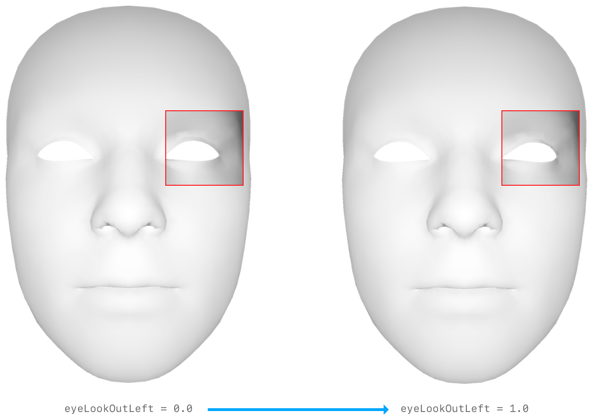
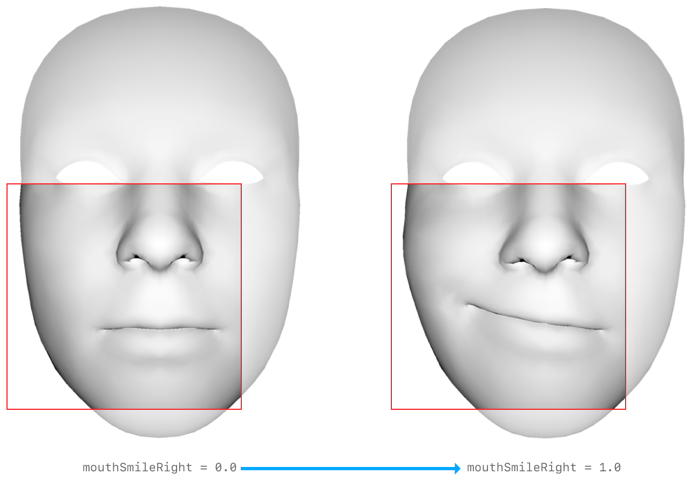
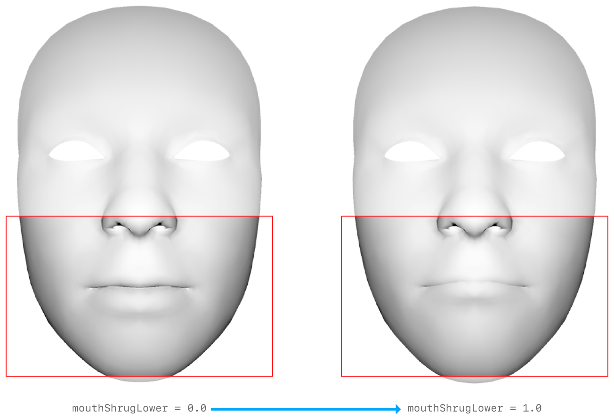

# BlendShapeLocation
## 左眼

| 系数 | 说明 | 示例图 |
| -----: | :-----: | :-----: |
| eyeBlinkLeft      | 描述左眼上眼睑闭合的系数 |  |
| eyeLookDownLeft   | 描述左眼皮运动与向下凝视一致的系数 |  |
| eyeLookInLeft     | 描述左眼皮运动与右眼注视一致的系数 |  |
| eyeLookOutLeft    | 描述左眼皮运动与左眼注视一致的系数 |  |
| eyeLookUpLeft     | 描述左眼皮运动与向上注视一致的系数 |  |
| eyeSquintLeft     | 描述左眼周围脸部收缩的系数 |  |
| eyeWideLeft       | 描述左眼周围眼睑变宽的系数 |  |

## 右眼

| 系数 | 说明 | 示例图 |
| -----: | :-----: | :-----: |
| eyeBlinkRight     | 描述右眼上眼睑闭合的系数          |  |
| eyeLookDownRight  | 描述右眼皮运动与向下凝视一致的系数 |  |
| eyeLookInRight    | 描述右眼皮运动与左眼注视一致的系数 |  |
| eyeLookOutRight   | 描述右眼皮与向右注视一致的系数     |  |
| eyeLookUpRight    | 描述右眼皮运动与向上注视一致的系数 |  |
| eyeSquintRight    | 描述右眼周围脸部收缩的系数        |  |
| eyeWideRight      | 描述右眼周围眼睑变宽的系数        |  |

## 嘴唇与上下颚

| 系数 | 说明 | 示例图 |
| -----: | :-----: | :-----: |
| jawForward            | 描述下颌向前运动的系数 |  |
| jawLeft               | 描述下颚向左移动的系数 |  |
| jawRight              | 描述下颌向右运动的系数 |  |
| jawOpen               | 描述下颚张开的系数 |  |
| mouthClose            | 该系数表示嘴唇的闭合与下颌的位置（系数）无关，因此，除非将其他系数也设置为真实值，否则该系数的某些值可能会产生不真实的面部表情 |  |
| mouthFunnel           | 描述双唇收缩成开放形状的系数 |  |
| mouthPucker           | 描述两个闭合嘴唇的收缩和压缩的系数 |  |
| mouthLeft             | 描述双唇一起向左移动的系数 |  |
| mouthRight            | 描述双唇一起向右运动的系数 |  |
| mouthSmileLeft        | 描述嘴左角向上运动的系数 |  |
| mouthSmileRight       | 描述嘴右角向上运动的系数 |  |
| mouthFrownLeft        | 描述嘴左角向下运动的系数 |  |
| mouthFrownRight       | 描述嘴右角向下运动的系数 |  |
| mouthDimpleLeft       | 描述嘴左角向后移动的系数 |  |
| mouthDimpleRight      | 描述嘴右角向后移动的系数 |  |
| mouthStretchLeft      | 描述嘴左角向左移动的系数 |  |
| mouthStretchRight     | 描述嘴左角向右移动的系数 |  |
| mouthRollLower        | 描述下唇向口腔内部运动的系数 |  |
| mouthRollUpper        | 描述上唇向口内运动的系数 |  |
| mouthShrugLower       | 描述下唇向外运动的系数 |  |
| mouthShrugUpper       | 描述上唇向外移动的系数 |  |
| mouthPressLeft        | 描述左侧下唇向上压缩的系数 |  |
| mouthPressRight       | 描述右侧下唇向上压缩的系数 |  |
| mouthLowerDownLeft    | 描述左侧下唇向下运动的系数 |  |
| mouthLowerDownRight   | 描述右侧下唇向下运动的系数 |  |
| mouthUpperUpLeft      | 描述左侧上唇向上运动的系数 |  |
| mouthUpperUpRight     | 描述右侧上唇向上运动的系数 |  |

## 眉毛、脸颊、鼻子

| 系数 | 说明 | 示例图 |
| -----: | :-----: | :-----: |
| browDownLeft      | 描述左眉外部向下运动的系数 |  |
| browDownRight     | 描述右眉外部向下运动的系数 |  |
| browInnerUp       | 描述两个眉毛内部向上运动的系数 |  |
| browOuterUpLeft   | 描述左眉外部向上运动的系数 |  |
| browOuterUpRight  | 描述右眉外部向上运动的系数 |  |
| cheekPuff         | 描述两个脸颊向外运动的系数 |  |
| cheekSquintLeft   | 描述脸颊在左眼周围和下方向上运动的系数 |  |
| cheekSquintRight  | 描述脸颊在右眼周围和下方向上运动的系数 |  |
| noseSneerLeft     | 该系数描述了鼻孔周围鼻子左侧的隆起 |  |
| noseSneerRight    | 该系数描述了鼻孔周围鼻子右侧的隆起 |  |

## 舌

| 系数 | 说明 | 示例图 |
| -----: | :-----: | :-----: |
| tongueOut | 描述舌头伸展的系数 | NULL |